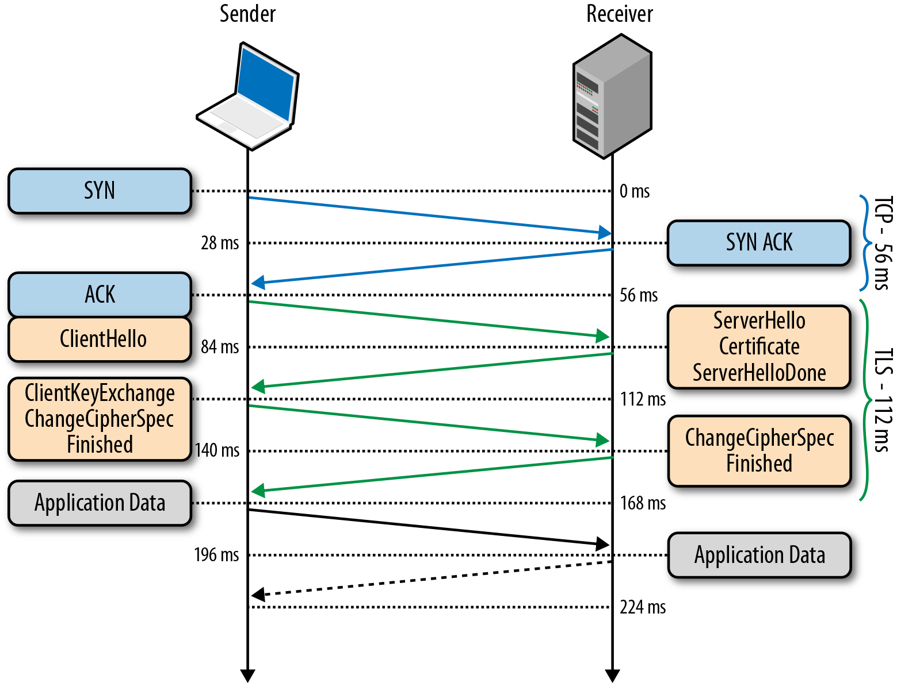

<style>
img[alt~="center"] {
  display: block;
  margin: 0 auto;
}
.columns {
  display: grid;
  grid-template-columns: repeat(2, minmax(0, 1fr));
  gap: 1rem;
}
.label {
  font-size: 20px !important;
}
</style>

# Семинар 10
> socket/bind/listen/accept/connect/getaddrinfo
> udp client
> tcp client
> tcp server
> tcpdump, dig, whois, nslookup, curl
> bonus: python
> AF_UNIX socket
> DPDK
> HTTP/2 vs QUIC
> TLS/SSL/Diffie-Hellman
> Что-то ручками настроить через ip addr / ip route?
> iptables

---

# Excuse

---

## Excuse

На слайдах места мало, поэтому часть кода пропущена

Полностью рабочий код (**ещё и с обработкой ошибок**) лежит на github))

---

# Сокеты

---

## Сокеты: напоминание

Являются точкой соединения 2-х машин в сети


---

## Сокеты: напоминание

Являются точкой соединения 2-х машин в сети

- сокетов всегда 2

---

## Сокеты: напоминание

Являются точкой соединения 2-х машин в сети

- сокетов всегда 2
  * одина на одной стороне

---

## Сокеты: напоминание

Являются точкой соединения 2-х машин в сети

- сокетов всегда 2
  * одина на одной стороне
  * второй на другой стороне

---

## Сокеты: напоминание

Являются точкой соединения 2-х машин в сети

- сокетов всегда 2
  * одина на одной стороне
  * второй на другой стороне
- всё есть файл (и сокет тоже) $\rightarrow$ с сокетом можно работать как с файлом

---

## Сокеты: напоминание

Являются точкой соединения 2-х машин в сети

- сокетов всегда 2
  * одина на одной стороне
  * второй на другой стороне
- всё есть файл (и сокет тоже) $\rightarrow$ с сокетом можно работать как с файлом
- любой сокет может работать и на чтение, и на запись

---

## Сокеты: напоминание

Являются точкой соединения 2-х машин в сети

- сокетов всегда 2
  * одина на одной стороне
  * второй на другой стороне
- всё есть файл (и сокет тоже) $\rightarrow$ с сокетом можно работать как с файлом
- любой сокет может работать и на чтение, и на запись
- сокеты не обязательно соединяют программы на разных машинах (socketpair)

---

## Сокеты: socketpair

```c
#include <unistd.h>
#include <stdio.h>
#include <sys/socket.h>

int main() {
  int fd[2];
  socketpair(AF_UNIX, SOCK_STREAM, 0, fd);

  // write to fd[0]; read from fd[1]
  {
    // ...
  }

  // vice versa
  {
    // ...
  }

  close(fd[0]);
  close(fd[1]);
  return 0;
}
```

---

## Сокеты: socketpair

```c
#include <unistd.h>
#include <stdio.h>
#include <sys/socket.h>

int main() {
  int fd[2];
  socketpair(AF_UNIX, SOCK_STREAM, 0, fd);

  // write to fd[0]; read from fd[1]
  {
    char msg[] = "write to fd[0]\n";
    write(fd[0], msg, sizeof(msg));

    char buffer[1024];
    size_t len = read(fd[1], buffer, sizeof(buffer));
    write(1, buffer, len);
  }

  // ...
}
```

---

## Сокеты: socketpair

```c
#include <unistd.h>
#include <stdio.h>
#include <sys/socket.h>

int main() {
  // ...

  // vice versa
  {
    char msg[] = "and vice versa!\n";
    write(fd[1], msg, sizeof(msg));

    char buffer[1024];
    size_t len = read(fd[0], buffer, sizeof(buffer));
    write(1, buffer, len);
  }
}
```

---

## Сокеты: socketpair

```c
#include <unistd.h>
#include <stdio.h>
#include <sys/socket.h>

int main() {
  int fd[2];
  socketpair(AF_UNIX, SOCK_STREAM, 0, fd);

  // write to fd[0]; read from fd[1]
  {
    char msg[] = "write to fd[0]\n";
    write(fd[0], msg, sizeof(msg));

    char buffer[1024];
    size_t len = read(fd[1], buffer, sizeof(buffer));
    write(1, buffer, len);
  }

  // vice versa
  {
    char msg[] = "and vice versa!\n";
    write(fd[1], msg, sizeof(msg));

    char buffer[1024];
    size_t len = read(fd[0], buffer, sizeof(buffer));
    write(1, buffer, len);
  }

  close(fd[0]);
  close(fd[1]);
  return 0;
}
```

---

# UDP

---

## UDP: example

```c
int main() {
  struct sockaddr_in server = {
    .sin_family = AF_INET,
    .sin_port = htons(8989),
    .sin_addr.s_addr = inet_addr("127.0.0.1"),
  };
  int server_len = sizeof(server);
  
  // if (socket_fd < 0) { ... }
  int socket_fd = socket(AF_INET, SOCK_DGRAM, 0);

  char buffer[] = "Hello, UDP!";
  // if (sendto(...) == 0) { ... }
  sendto(
    socket_fd,
    buffer,
    sizeof(buffer),
    0,
    (struct sockaddr*)(&server),
    server_len
  );

  close(socket_fd);
}
```

---

## UDP: example

Поднимаем udp-сервер (в отдельном терминале)
```bash
nc -u -l -p 8989
```

И запускаем программу
```bash
gcc main.c
./a.out
```

> в терминале с udp-сервером будет выведено сообщение

---

# TCP

---

## TCP: TCP vs UDP


---

## TCP: TCP vs UDP


---

## TCP: example (client)

```c
int main() {
    // if (socket_fd < 0) { ... }
    int socket_fd = socket(AF_INET, SOCK_STREAM, 0);

    struct sockaddr_in addr = {
        .sin_family = AF_INET,
        .sin_port = htons(8989),
        .sin_addr.s_addr = inet_addr("127.0.0.1"),
    };

    // if (connect(...) < 0) { ... }
    connect(socket_fd, (struct sockaddr*)(&addr), sizeof(addr));

    
    char msg[] = "this is message to tcp socket";
    printf("to server: \"%s\"\n", msg);
    write(socket_fd, msg, sizeof(msg));

    char buffer[256];
    read(socket_fd, buffer, sizeof(buffer));
    printf("from server: \"%s\"\n", buffer);

    shutdown(socket_fd, SHUT_RDWR);
    close(socket_fd);

    return 0;
}
```

---

## TCP: example (server)

```c
int main() {
    // if (socket_fd < 0) { ... }
    int socket_fd = socket(AF_INET, SOCK_STREAM, 0);

    struct sockaddr_in addr = {
        .sin_family = AF_INET,
        .sin_port = htons(8989),
        .sin_addr.s_addr = INADDR_ANY,
    };

    // if (bind(...) < 0) { ... }
    bind(socket_fd, (struct sockaddr*)(&addr), sizeof(addr));
    // if (listen(...) < 0) { ... }
    listen(socket_fd, SOMAXCONN);

    // if (client_fd < 0) { ... }
    int client_fd = accept(socket_fd, NULL, NULL);

    char buffer[256];
    read(client_fd, buffer, sizeof(buffer));
    printf("from client: \"%s\"\n", buffer);

    char msg[] = "message to client";
    printf("to client: \"%s\"\n", msg);
    write(client_fd, msg, sizeof(msg));

    // заканчиваем взаимодействие с клиентом
    shutdown(client_fd, SHUT_RDWR);
    close(client_fd);

    // закрываем сокет
    close(socket_fd);

    return 0;
}
```

---

# Командочки, чтоб было проще жить

---

## Командочки, чтоб было проще жить

- tcpdump
- dig
- whois
- nslookup
- curl

---

# Ещё немного извращений (DPDK)

---

## DPDK

1. пакет поступает на сетевую карту
2. он копируется оттуда в основную память
3. далее требуется сообщить системе о появлении нового пакета и передать в специально выделенный буфер
> чем больше пакетов приходится обрабатывать, тем больше на это уходит ресурсов (долго и дорого)
4. далее когда приложению требуется принять или отправить пакет, оно делает системный вызов, и происходит переключение контекста в режим ядра, а затем — обратно в пользовательский режим
> очень дорого по ресурсам

---

## DPDK


---

## DPDK

Чтоб это сделать, нужно 'вывести' порты из-под управления ядра и 'передать' их DPDK

Алоритм обработки будет следующий

1. Поступившие пакеты попадают в кольцевой буфер (его устройство мы разберём в следующем разделе). Приложение периодически проверяет этот буфер на наличие новых пакетов.
2. Если в буфере имеются новые дескрипторы пакетов, приложение обращается к буферам пакетов DPDK, находящимся в специально выделенном пуле памяти, через указатели в дескрипторах пакетов.
3. Если в кольцевом буфере нет никаких пакетов, то приложение опрашивает находящиеся под управлением DPDK сетевые устройства, а затем снова обращается к кольцу.

---

## DPDK

Заинтересовавшихся отсылаю к статье

- [Введение в DPDK: архитектура и принцип работы](https://habr.com/ru/companies/selectel/articles/313150/)

---

# QUIC

---

## QUIC: история HTTP

1. HTTP 1.1 - text data over TCP
2. HTTP 2.0 - (HTTP + SPDY)
3. HTTP 3.0 - (HTTP + QUIC)

---

## QUIC: история HTTP

1. HTTP 1.1 - text data over TCP

---

## QUIC: история HTTP

1. HTTP 1.1 - text data over TCP
- все данные в виде текста

---

## QUIC: история HTTP

1. HTTP 1.1 - text data over TCP
- все данные в виде текста
- один запрос - одно подключение (+попытка исправить с keep-alive)

---

## QUIC: история HTTP

1. HTTP 1.1 - text data over TCP
- все данные в виде текста
- один запрос - одно подключение (+попытка исправить с keep-alive)
2. HTTP 2.0 - (HTTP + SPDY)

---

## QUIC: история HTTP

1. HTTP 1.1 - text data over TCP
- все данные в виде текста
- один запрос - одно подключение (+попытка исправить с keep-alive)
2. HTTP 2.0 - (HTTP + SPDY)
- бинарные данные

---

## QUIC: история HTTP

1. HTTP 1.1 - text data over TCP
- все данные в виде текста
- один запрос - одно подключение (+попытка исправить с keep-alive)
2. HTTP 2.0 - (HTTP + SPDY)
- бинарные данные
- мультиплексирование

---

## QUIC: история HTTP

1. HTTP 1.1 - text data over TCP
- все данные в виде текста
- один запрос - одно подключение (+попытка исправить с keep-alive)
2. HTTP 2.0 - (HTTP + SPDY)
- бинарные данные
- мультиплексирование
- одно подключение

---

## QUIC: история HTTP

1. HTTP 1.1 - text data over TCP
- все данные в виде текста
- один запрос - одно подключение (+попытка исправить с keep-alive)
2. HTTP 2.0 - (HTTP + SPDY)
- бинарные данные
- мультиплексирование
- одно подключение
- server push (отправка до запроса)

---

## QUIC: история HTTP

3. HTTP 3.0 - (HTTP + QUIC)
- протокол поверх UPD!
- больше сжатия
- короткие заголовки
-  ...

---

## QUIC: сравнение


---

## QUIC: что почитать?

- [Ультимативный гайд по HTTP. HTTP/1.1 vs HTTP/2](https://habr.com/ru/companies/avito/articles/710678/)
- [Транспортный протокол QUIC приняли в качестве стандарта RFC 9000](https://habr.com/ru/companies/globalsign/articles/560342/)
- [Quic от Google](https://habr.com/ru/articles/719598/)
- [What Is HTTP/3 and How Does It Differ from HTTP/2?](https://gcore.com/learning/what-is-http-3/)

---

# TLS / SSL

---

## TLS / SSL: а что? а зачем?

- HTTP

---

## TLS / SSL: а что? а зачем?

- HTTP
- HTTPS

---

## TLS / SSL: а что? а зачем?

- HTTP
- HTTPS <-- вот тут SSL

---

## TLS / SSL: а как?



---

## TLS / SSL на пальцах: Алгоритм Diffie-Hellman

1. Алиса и Боб выбирают общие параметры: основание `g` (допустим, 5) и большое простое число `p` (допустим, 23).
2. Алиса генерирует свой секретный ключ `a` (допустим, 6) и вычисляет свой публичный ключ: `A = g^a mod p = 5^6 mod 23 = 15625 mod 23 = 8`
3. Боб генерирует свой секретный ключ `b` (допустим, 9) и вычисляет свой публичный ключ: `B = g^b mod p = 5^9 mod 23 = 1953125 mod 23 = 11`
4. Алиса и Боб обмениваются публичными ключами: Алиса отправляет свой ключ `A` (8) Бобу, а Боб отправляет свой ключ `B` (11) Алисе.
5. Алиса вычисляет общий секретный ключ `s = B^a mod p = 11^6 mod 23 = 1771561 mod 23 = 9`
6. Боб вычисляет общий секретный ключ `s = A^b mod p = 8^9 mod 23 = 134217728 mod 23 = 9.`

---

## TLS / SSL на пальцах: Алгоритм Diffie-Hellman

1. Алиса и Боб выбрали `g` и большое простое число `p`
2. Алиса придумала `a` и вычислила
`A = g^a mod p = 5^6 mod 23 = 15625 mod 23 = 8`
3. Боб придумал `b` и вычислил
`B = g^b mod p = 5^9 mod 23 = 1953125 mod 23 = 11`
4. Алиса и Боб обменялись `A` и `B`
5. Алиса считает `s = B^a mod p = 11^6 mod 23 = 1771561 mod 23 = 9`
6. Боб считает `s = A^b mod p = 8^9 mod 23 = 134217728 mod 23 = 9.`

Очевидно, что
`B^a mod p = (g^b mod p)^a mod p = (g^b)^a mod p = (g^a)^b mod p `
`= A^b mod p`

---

## TLS / SSL: сертификаты

- а как проверить, что ресурс тот?
- как проверить, что ресурс 'доверенный'?

---

## TLS / SSL: сертификаты

- а ещё есть _Let's Encrypt_, который делает это бесплатно


---

## TLS / SSL: что почитать?

- [Что такое TLS](https://habr.com/ru/articles/258285/)
- [Алгоритм Diffie-Hellman: Ключ к безопасному общению](https://habr.com/ru/articles/726324/)
- [Использование Let's Encrypt для внутренних серверов](https://habr.com/ru/articles/568378/)

---

# FAQ

---

# FAQ
# (FU! у меня не работает!!!)

---

## FAQ: а как тестить проще?

- есть `netcat` и `nc`
- а ещё есть `python`

---

## FAQ: только что работало, а сейчас не работает...

Попробуй запустить `netstat -tulpn`

Возможно какой-то процесс _уже_ / _всё ещё_ слушает этот порт

---

## FAQ: периодически получаю 'bind: Address already in use'

Если `netstat -tulpn` не дал результатов,
можешь запустить `netstat -a -o -n | grep <port>`

Пример: `netstat -a -o -n | grep 8989`

Возможно на порту висит `TIME_WAIT` и придётся подождать пару-тройку минут

Подробнее про `TIME_WAIT`
- [вот тут](https://ip-calculator.ru/blog/ask/chto-za-sostoyaniya-close_wait-i-time_wait/)
- [и ещё здесь](https://en.wikipedia.org/wiki/Transmission_Control_Protocol)

---

# А что почитать?

1. `man 2 socket`
2. `man <я_не_знаю_что_это_и_зачем>`
3. [Полезные трюки при работе с netcat](https://habr.com/ru/articles/336596/)
4. [Используем tcpdump для анализа и перехвата сетевого трафика](https://habr.com/ru/companies/alexhost/articles/531170/)
5. [CS144, Introduction to Computer Networking](https://www.youtube.com/watch?v=qAFI-2I7wPE&list=PLoCMsyE1cvdWKsLVyf6cPwCLDIZnOj0NS)
6. [Introduction to TCP/IP by Yonsei University](https://www.youtube.com/watch?v=jppeQEuzzpA)


---

# Спасибо!)

