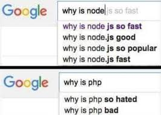

<style>
img[alt~="center"] {
  display: block;
  margin: 0 auto;
}
.columns {
  display: grid;
  grid-template-columns: repeat(2, minmax(0, 1fr));
  gap: 1rem;
}
.label {
  font-size: 20px !important;
}
</style>

# Семинар 11
> Apache (fork model) vs nginx (multiplexing mode)
> /dev/poll vs select/epoll vs kqueue
> 10k problem
> SO_REUSEADDR и SO_REUSEPORT
> listening sockets: single vs multiple

---

# Apache

---

## Apache

А пробовали ли вы писать backend?

---

## Apache

А пробовали ли вы писать backend?

Видели что-то похожее?)

```jinja
{# templates/results.html #}

<div>
  <h1>{{ test_name }} Results</h1>
  <ul>
  
    <li>
      <em>{{ student.name }}:</em> {{ student.score }}/{{ max_score }}
    </li>
  
  </ul>
</div>

```

---

## Apache

А пробовали ли вы писать backend?

Видели что-то похожее?) (если что это - jinja-templates)

```jinja
{# templates/results.html #}

<div>
  <h1>{{ test_name }} Results</h1>
  <ul>
  
    <li>
      <em>{{ student.name }}:</em> {{ student.score }}/{{ max_score }}
    </li>
  
  </ul>
</div>

```

---

## Apache

А теперь найдите 10 отличий)))

```php
<div>
    <?php echo '<p>Hello World</p>'; ?>
    
    <?php
    if (str_contains($_SERVER['HTTP_USER_AGENT'], 'Firefox')) {
    ?>
        <h3>str_contains() returned true</h3>
        <p>You are using Firefox</p>
    <?php
    } else {
    ?>
        <h3>str_contains() returned false</h3>
        <p>You are not using Firefox</p>
    <?php
    }
    ?>
</div>
```

---

## Apache

Ну т.е. ещё раз... Вот так было:

```php
<div>
    <? if ($condition): ?>
      <p>Content</p>
    <? elseif ($other_condition): ?>
      <p>Other Content</p>
    <? else: ?>
</div>
```

А так стало:

```jinja
<div>
    
        <p>Content</p>
    
        <p>Other Content</p>
    
</div>
```

---

## Apache

А использовалось так

Обычный скучный сайт:
`https://www.php.net/manual/en/indexes.examples.html`

Порождение рептилоидов сверхлюдей:
`https://www.php.net/manual/en/indexes.examples.php`

---

## Apache

А использовалось так

Обычный скучный сайт:
`https://www.php.net/manual/en/indexes.examples.html`

Порождение рептилоидов сверхлюдей:
`https://www.php.net/manual/en/indexes.examples.php`

(да, там поменялось расширение)

---

## Apache

И Apache предоставлял реализацию этих секретных технологий сверхлюдей

---

## Apache: особенности

- создавался для Linux
- работает на Linux
- на каждый connect отдельный процесс

---

# Nginx

---

## Nginx

- reverse proxy
- создавался для Linux
- работает на Linux
- умеет работать с connect-ами эффективно

---

## Nginx

На самом деле помимо перенаправления (роутинга) трафика, Nginx умеет отдавать статические файлы.

---

## Nginx

На самом деле помимо перенаправления (роутинга) трафика, Nginx умеет отдавать статические файлы.
..
.html / .css / .js / .ttf / ...

---

# SINGLE vs FORK vs EPOLL

---

## SINGLE vs FORK vs EPOLL

тут смотрим примеры

---

## Apache --> Node JS



---

## Apache --> literally anything

# 10k problem

---

# SO_REUSEADDR

`SO_REUSEADDR` позволяет сокету привязаться (bind) к порту, используемому другим сокетом (через setsockopt)

---

# SO_REUSEADDR

`SO_REUSEADDR` позволяет сокету привязаться (bind) к порту, используемому другим сокетом (через setsockopt)

После успешной привязки второго сокета поведение всех сокетов, привязанных к порту, будет **неопределенным**

---

# SO_REUSEADDR и SO_REUSEPORT

---

## SO_REUSEADDR

If `SO_REUSEADDR` is enabled on a socket prior to binding it, the socket can be successfully bound unless there is a conflict with another socket bound to exactly the same combination of source address and port. Now you may wonder how is that any different than before? The keyword is "exactly". SO_REUSEADDR mainly changes the way how wildcard addresses ("any IP address") are treated when searching for conflicts.

---

## SO_REUSEPORT

`SO_REUSEPORT` is what most people would expect SO_REUSEADDR to be. Basically, `SO_REUSEPORT` allows you to bind an arbitrary number of sockets to exactly the same source address and port as long as all prior bound sockets also had SO_REUSEPORT set before they were bound. If the first socket that is bound to an address and port does not have SO_REUSEPORT set, no other socket can be bound to exactly the same address and port, regardless if this other socket has SO_REUSEPORT set or not, until the first socket releases its binding again. Unlike in case of SO_REUSEADDR the code handling SO_REUSEPORT will not only verify that the currently bound socket has SO_REUSEPORT set but it will also verify that the socket with a conflicting address and port had SO_REUSEPORT set when it was bound.

---
