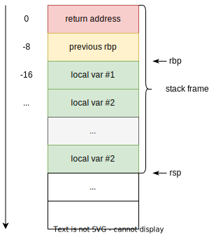

<style>
img[alt~="center"] {
  display: block;
  margin: 0 auto;
}
.columns {
  display: grid;
  grid-template-columns: repeat(2, minmax(0, 1fr));
  gap: 1rem;
}
.label {
  font-size: 20px !important;
}
</style>

# Семинар 4
> Регистры, Базовые команды, Стек и вызов функций
> SIMD (shufps/etc), Syscalls (хотелось бы вынести отдельно)

---

# Пара слов про ассемблер

- +-мнемоники машинных команд
- платформозависимый
- компиляторозависимый
- синтаксисозависимый (intel vs at&t)


---

# Стек
> картинка нагло украдена из лекции



---

# SSE

В современных Intel/AMD процессорах есть 16 регистров (в 32-разрядном режиме доступны только 8), которые предназначены как для вещественных операций, так и для целочисленных.

128-битные регистры MMX/SSE именуются `xmm0...xmm7, xmm8...xmm15`.

256-битные регистры AVX `ymm0...ymm15` подразумевают, что их младшие 128 бит совпадают с регистрами MMX/SSE.

512-битные регистры AVX-512 (новые Xeon и Core i9) `zmm0...zmm15` подразумевают, что младшие 256 бит совпадают с регистрами AVX.

---

# Скалярные операции над регистрами SSE

```as
// Копирование регистр-регистр и регистр-память
movsd   DST, SRC  // пересылка double
movss   DST, SRC  // пересылка float

// Арифметические
addsd   DST, SRC   // DST += SRC, double
addss   DST, SRC   // DST += SRC, float
subsd   DST, SRC   // DST -= SRC, double
subss   DST, SRC   // DST -= SRC, float
mulsd   DST, SRC   // DST *= SRC, double
mulss   DST, SRC   // DST *= SRC, float
divsd   DST, SRC   // DST /= SRC, double
divss   DST, SRC   // DST /= SRC, float
sqrtsd  DST, SRC   // DST = sqrt(SRC), double
sqrtss  DST, SRC   // DST = sqrt(SRC), float
maxsd   DST, SRC   // DST = max(DST, SRC), double
maxss   DST, SRC   // DST = max(DST, SRC), float
minsd   DST, SRC   // DST = min(DST, SRC), double
minss   DST, SRC   // DST = min(DST, SRC), float

// Преобразования
cvtsd2si DST, SRC  // double -> int
cvtsi2sd DST, SRC  // int -> double

// Сравнения (операция DST-SRC, которая меняет флаги)
comisd  DST, SRC  // для double
comiss  DST, SRC  // для float
```

---

# Векторные операции над регистрами SSE (SIMD)

Между регистрами можно выполнять векторные операции, то есть операции сразу над несколькими 8, 16, 32 или 64-битными значениями, которые хранятся в паре 128-битных регистров.

Общий вид таких команд следующий:

```as
OPERATION p [s|d]
```

где `OPERATION` - это одна из операций `add, mul и т.д.`, буква `p` в названии команды является сокращением от `packed`, а `s` или `d` - это single или double точность вещественных чисел.

---

Загрузка/сохранение выполняется вариантами команды `mov`:

```as
mov[ap|up][s|d]   DST, SRC
```

где `ap` - загрузка/сохнанение из памяти, выровненной по границе размера регистра (16 байт), `up` - для невыровненной памяти.

Использование операндов в памяти для операций, отличных от mov, возможно только для выровненной памяти.

Для задействования векторных инструкций не обязательно использовать язык ассемблера. Компиляторы `Intel` и `gcc` имеют поддержку псевдо-функций, объявленных в заголовочных файлах вида `*intrin.h`, которые транслируются в эти инструкции при компиляции. Подробный Reference доступен [здесь](https://software.intel.com/sites/landingpage/IntrinsicsGuide/) (VPN-only ссылка).
