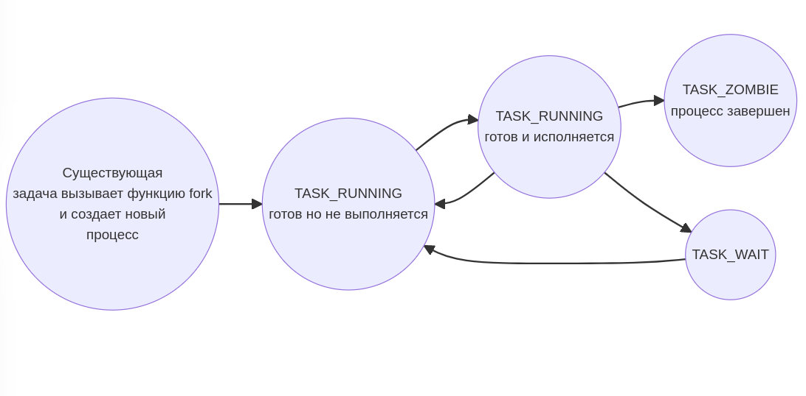

<style>
img[alt~="center"] {
  display: block;
  margin: 0 auto;
}
.columns {
  display: grid;
  grid-template-columns: repeat(2, minmax(0, 1fr));
  gap: 1rem;
}
.label {
  font-size: 20px !important;
}
</style>

# Семинар 7
> fork/exec
> pthread_create/pthread_join

---

# Давайте поговорим о процессах

Давайте пофантазируем, что такое `процесс`?

---

# Давайте поговорим о процессах

Давайте пофантазируем, что такое `процесс`?
(надеюсь сейчас как-то что-то интуитивно кажется)

---

# Давайте поговорим о процессах

Давайте пофантазируем, что такое `процесс`?
(надеюсь сейчас как-то что-то интуитивно кажется)

Давайте по пунктам
1.
2.
3.

---

# Хто я? (с) процесс

Сейчас вам дам точное определение

---

# Хто я? (с) процесс

Сейчас вам дам точное определение
потому что я погуглил)

---

# Хто я? (с) процесс

Процесс - программа в состоянии выполнения. Он включает в себя:

1. Исполняемый код (section .text)
2. Открытые файлы
3. Сигналы, ожидающие обработки
4. Внутренние данные ядра (об этом позже)
5. Состояние процессора (регистры)
6. Адресное пространство, в которое отображены один или несколько файлов (mmap)
7. Один или несколько потоков выполнения (на самом деле это стек)
8. Сегмент данных с глобальными переменными (section .data / .rodata / .bss)

---

## 1. Исполняемый код

Чтобы что-то исполнять, нам нужно это что-то (вода мокрая, небо голубое, щеночки милые...)

Этим 'чем-то' и является исходный код -- машинные инструкции

---

## 2. Открытые файлы

За ввод-вывод данных отвечает ядро

По умолчанию у любого процесса есть 3 открытых файловых дескриптора (stdin, stdout, stderr)

Кажется логичным, что информацию об открытых файлах должно хранить ядро)

---

## 3. Сигналы, ожидающие обработки

Это что-то про inter process communication (IPC)

Идейно это похоже на syscall-наоборот

(про это будет на ближайшей лекции)

---

## 4. Внутренние данные ядра

У процесса есть статус (Running, Waiting, Zombie, etc...)

Процессы выстраиваются в дерево

...

---

## 4. Внутренние данные ядра

Есть замечательный файлик [linux/sched.h](https://github.com/torvalds/linux/blob/master/include/linux/sched.h), в котором описана структуа `task_struct` (сама структурка сильно больше)

```c
struct task_struct {
    // эта фигня есть в адресном пространстве прцесса (с указателем на сюда)
    struct thread_info          thread_info;
    unsigned int                __state;
    /* что-то про priority... */
    int                         prio;
    int                         static_prio;
    int                         normal_prio;

    /* Real parent process: */
    struct task_struct __rcu    *real_parent;  // родитель №1
    /* Recipient of SIGCHLD, wait4() reports: */
    struct task_struct __rcu    *parent;       // родитель №2

    pid_t                       pid;
    unsigned int                policy;

    /* Children/sibling form the list of natural children: */
    struct list_head            children;
    struct list_head            sibling;
};

```

---

## 5. Состояние процессора

Возможно вы заметили, как трудно было писать на ассемблере - приходилось постоянно думать, как ваша программа, находясь в оперативной памяти, мешает исполняться другим программам?)

---

## 5. Состояние процессора

Возможно вы заметили, как трудно было писать на ассемблере - приходилось постоянно думать, как ваша программа, находясь в оперативной памяти, мешает исполняться другим программам?)

Нет!)) Все было просто))

---

## 5. Состояние процессора

Возможно вы заметили, как трудно было писать на ассемблере - приходилось постоянно думать, как ваша программа, находясь в оперативной памяти, мешает исполняться другим программам?)

Нет!)) Все было просто)))

Все благодаря виртуализации - каждый процесс думает, что он единственный запущенный процесс в системе!)

---

## 6. Адресное пространство и mmap

В принципе можно отнести к внутренним данным ядра

Но хочу выделить отдельно)

---

## 7. Потоки выполнения

В одном процессе может быть несколько потоков выполнения (та самая многопоточность)

Если прям упрощать-упрощать, то тут хранится стек

---

## 8. Сегмент данных с глобальными переменными (section .data / .rodata / .bss)

Тут вроде все очевидно

---

## Вопросики?

Процесс - программа в состоянии выполнения. Он включает в себя:

1. Исполняемый код (section .text)
2. Открытые файлы
3. Сигналы, ожидающие обработки
4. Внутренние данные ядра (об этом позже)
5. Состояние процессора (регистры)
6. Адресное пространство, в которое отображены один или несколько файлов (mmap)
7. Один или несколько потоков выполнения (на самом деле это стек)
8. Сегмент данных с глобальными переменными (section .data / .rodata / .bss)

---

# ~~Не хотите поговорить о боге?~~
# А теперь холиварная тема о потоках и процессах в Linux

---

## ПОТОК = ПРОЦЕСС

---

## ПОТОК = ПРОЦЕСС

## ПРОЦЕССОВ НЕ СУЩЕСТВУЕТ

---

## ПОТОК = ПРОЦЕСС

## ПРОЦЕССОВ НЕ СУЩЕСТВУЕТ

## ПОТОКОВ НЕ СУЩЕСТВУЕТ

---

## ПОТОК = ПРОЦЕСС

## ПРОЦЕССОВ НЕ СУЩЕСТВУЕТ

## ПОТОКОВ НЕ СУЩЕСТВУЕТ

## ...

---

## поток = процесс

В Linux процесс описывается структуркой

Да и все уникальные (пункты 1-8) хранятся в виде указателей

А что мешает этим полям в двух разных процессах указывать на одну и ту же память?

---

## поток = процесс

В Linux процесс описывается структуркой

Да и все уникальные (пункты 1-8) хранятся в виде указателей

А что мешает этим полям в двух разных процессах указывать на одну и ту же память?

**ничего!**

---

Сейчас будет фокус

Кому интересен секрет фокуса, вот две статьи на хабре
* welcome to namespaces: [Глубокое погружение в Linux namespaces](https://habr.com/ru/post/458462/)
* welcome to cgroups: [Механизмы контейнеризации: cgroups](https://habr.com/ru/companies/selectel/articles/303190/)

---

```bash
$ ps -A | head -10
    PID TTY          TIME CMD
      1 ?        00:00:03 systemd
      2 ?        00:00:00 kthreadd
      3 ?        00:00:00 rcu_gp
      4 ?        00:00:00 rcu_par_gp
      5 ?        00:00:00 slub_flushwq
      6 ?        00:00:00 netns
     11 ?        00:00:00 mm_percpu_wq
     13 ?        00:00:00 rcu_tasks_kthread
     14 ?        00:00:00 rcu_tasks_rude_kthread
```

```bash
$ sudo unshare --pid --fork --mount-proc /bin/bash
[sudo] password for danila: 
# ps -A
    PID TTY          TIME CMD
      1 pts/0    00:00:00 bash
      2 pts/0    00:00:00 ps
```

---

А вот ещё один страшный пример

```c
#include <stdio.h>
#include <stdlib.h>
#include <unistd.h>
#include <pthread.h>

void *myThreadFun(void *vargp)
{
    printf("THREAD pid: %d\n", getpid());
    sleep(3);
    return NULL;
}

int main()
{
    printf("PROCESS pid: %d\n", getpid());
    pthread_t thread_id;
    pthread_create(&thread_id, NULL, myThreadFun, NULL);
    sleep(5);
    pthread_join(thread_id, NULL);
    exit(0);
}
```

---

(сори, не влезло)

```bash
$ ./a.out 
PROCESS pid: 94224
THREAD pid: 94224
```

---

## А как так то?...

На каждый ресурс системы (память / дерево процессов / сигналы / открытые fd / ...) есть своя группа

---

## А как так то?...

На каждый ресурс системы (память / дерево процессов / сигналы / открытые fd / ...) есть своя группа

Грубо говоря, кто в группе, тот и имеет доступ

---

## А как так то?...

На каждый ресурс системы (память / дерево процессов / сигналы / открытые fd / ...) есть своя группа

Грубо говоря, кто в группе, тот и имеет доступ

**Процесс - тоже группа**

---

## А как так то?...

На каждый ресурс системы (память / дерево процессов / сигналы / открытые fd / ...) есть своя группа

Грубо говоря, кто в группе, тот и имеет доступ

**Процесс - тоже группа**

В этой группе потоки находятся

---

## А как так то?...

На каждый ресурс системы (память / дерево процессов / сигналы / открытые fd / ...) есть своя группа

Грубо говоря, кто в группе, тот и имеет доступ

**Процесс - тоже группа**

В этой группе потоки находятся

Поток может покинуть группу процесса, сменив указатель на другую структурку

---

## А как так то?...

На каждый ресурс системы (память / дерево процессов / сигналы / открытые fd / ...) есть своя группа

Грубо говоря, кто в группе, тот и имеет доступ

**Процесс - тоже группа**

В этой группе потоки находятся

Поток может покинуть группу процесса, сменив указатель на другую структурку

Формально такой сущности как процесс в планировщике нет. И в ядре тоже нет.

---

## А как так то?...

На каждый ресурс системы (память / дерево процессов / сигналы / открытые fd / ...) есть своя группа

Грубо говоря, кто в группе, тот и имеет доступ

**Процесс - тоже группа**

В этой группе потоки находятся

Поток может покинуть группу процесса, сменив указатель на другую структурку

Формально такой сущности как процесс в планировщике нет. И в ядре тоже нет.

Есть группа процесса. Которая ничем не отличается от других подобных групп

---

## А как так то?...

На каждый ресурс системы (память / дерево процессов / сигналы / открытые fd / ...) есть своя группа

Грубо говоря, кто в группе, тот и имеет доступ

**Процесс - тоже группа**

В этой группе потоки находятся

Поток может покинуть группу процесса, сменив указатель на другую структурку

Формально такой сущности как процесс в планировщике нет. И в ядре тоже нет.

Есть группа процесса. Которая ничем не отличается от других подобных групп

**Планировщик ядра оперирует только потоками**

---

# Детство, Отрочество, Юность... этапы жизни процесса



---

# Как создаётся процесс

## fork $\rightarrow$ clone $\rightarrow$ do_fork $\rightarrow$ copy_process

---

# Как создаётся процесс

## fork $\rightarrow$ clone $\rightarrow$ do_fork $\rightarrow$ copy_process

в первом приближении создание процесса выполняет копирование структурки
(копирование НЕрекурсивно)

---

# Как создаётся процесс

## fork $\rightarrow$ clone $\rightarrow$ do_fork $\rightarrow$ copy_process

в первом приближении создание процесса выполняет копирование структурки
(копирование НЕрекурсивно)

во втором приближиении оказывается, что мы были правы

---

# Как создаётся процесс

## fork $\rightarrow$ clone $\rightarrow$ do_fork $\rightarrow$ copy_process

в первом приближении создание процесса выполняет копирование структурки
(копирование НЕрекурсивно)

во втором приближиении оказывается, что мы были правы

а теперь вспоминаем про **COW** и становимся гуру)

---

## Вопросы на понимание

Что из нижеперечисленного наследует дочерний процесс (и почему?)
(и что происходит с этим при изменении?)

1. Исполняемый код (section .text)
1. Открытые файлы
1. Сигналы, ожидающие обработки
1. Внутренние данные ядра
1. Состояние процессора (регистры)
1. Адресное пространство, в которое отображены один или несколько файлов (mmap)
1. Один или несколько потоков выполнения (на самом деле это стек)
1. Сегмент данных с глобальными переменными (section .data / .rodata / .bss)

---

# Клоны, близнецы, родители, убийства, зомби, удочерение, и прочая санта барбара...
# у нас тут весело

---

## Короче

1. Когда один процесс порождает другой процесс, он **клонирует** себя (**fork** / **clone**)

---

## Короче

1. Когда один процесс порождает другой процесс, он **клонирует** себя (**fork** / **clone**)
1. Новый процесс называется **дочерним** (**child process**), старый процесс называется **родительским** (**parent process**)

---

## Короче

1. Когда один процесс порождает другой процесс, он **клонирует** себя (**fork** / **clone**)
1. Новый процесс называется **дочерним** (**child process**), старый процесс называется **родительским** (**parent process**)
1. Процессы, с общим родителям называются **siblings**

---

## Короче

1. Когда один процесс порождает другой процесс, он **клонирует** себя (**fork** / **clone**)
1. Новый процесс называется **дочерним** (**child process**), старый процесс называется **родительским** (**parent process**)
1. Процессы, с общим родителям называются **siblings**
1. Мы можем послать **сигнал**, чтоб **kill** другой процесс (об этом - когда будут сигналы)

---

## Короче

1. Когда один процесс порождает другой процесс, он **клонирует** себя (**fork** / **clone**)
1. Новый процесс называется **дочерним** (**child process**), старый процесс называется **родительским** (**parent process**)
1. Процессы, с общим родителям называются **siblings**
1. Мы можем послать **сигнал**, чтоб **kill** другой процесс (об этом - когда будут сигналы)
1. После смерти, процесс превращается в **zombie**. До тех пор, пока кто-то не дождется его **exit_success**

---

## Короче

1. Когда один процесс порождает другой процесс, он **клонирует** себя (**fork** / **clone**)
1. Новый процесс называется **дочерним** (**child process**), старый процесс называется **родительским** (**parent process**)
1. Процессы, с общим родителям называются **siblings**
1. Мы можем послать **сигнал**, чтоб **kill** другой процесс (об этом - когда будут сигналы)
1. После смерти, процесс превращается в **zombie**. До тех пор, пока кто-то не дождется его **exit_success**
1. Если родительский процесс умер раньше, то дочерний процесс **удочеряет** другой процесс из родительской группы (или init)

---


---

# Один слайд про fork

```c
#include <stdio.h>
#include <unistd.h>

int main() {
    printf("hello!\n");

    pid_t pid = fork();
    printf("world! I am %d)\n", pid);
}
```

```bash
$ gcc main.c && ./a.out 
hello!
world! I am 92656)
world! I am 0)
```

---

# It's примеры time
