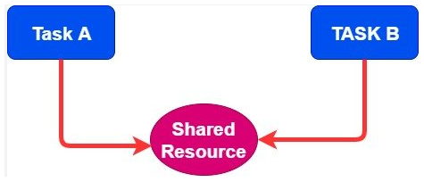
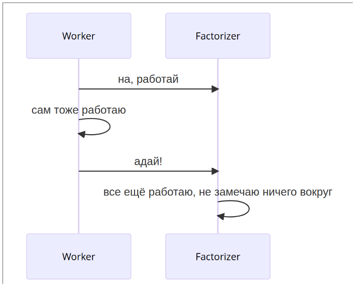
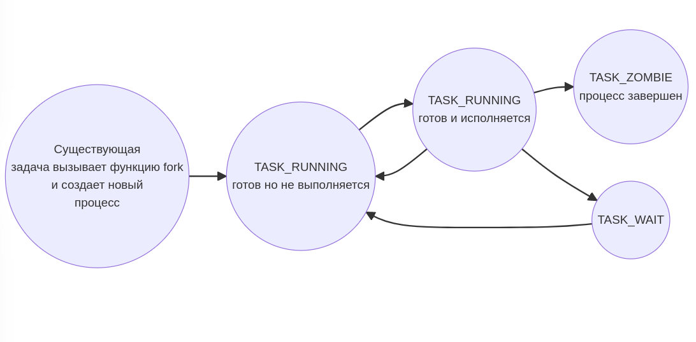

<style>
img[alt~="center"] {
  display: block;
  margin: 0 auto;
}
.columns {
  display: grid;
  grid-template-columns: repeat(2, minmax(0, 1fr));
  gap: 1rem;
}
.label {
  font-size: 20px !important;
}
</style>

# Семинар 8
> exec/simple_shell
> mutex/condvar + atomics + lockfree stack

---

# Давайте продолжим говорить о процессах)

Помните, как работает fork?

---

## Тот самый один слайд про fork

```c
#include <stdio.h>
#include <unistd.h>

int main() {
    printf("hello!\n");

    pid_t pid = fork();
    printf("world! I am %d)\n", pid);
}
```

```bash
$ gcc main.c && ./a.out 
hello!
world! I am 92656)
world! I am 0)
```

---

## Тот самый один слайд про fork

А как... запускаются другие программы?

```c
#include <stdio.h>
#include <unistd.h>

int main() {
    printf("hello!\n");

    pid_t pid = fork();
    printf("world! I am %d)\n", pid);
}
```

```bash
$ gcc main.c && ./a.out 
hello!
world! I am 92656)
world! I am 0)
```

---

## Тот самый один слайд про fork

А как... запускаются другие программы?

```c
#include <stdio.h>
#include <unistd.h>

int main() {
    printf("hello!\n");

    pid_t pid = fork();  // <--- вот тут 'мы раздваиваемся'

    //  и вот тут существуют идентичные
    // (с точки зрения контекста исполнения)
    // процессы
    // Т.е. тут одинаковые процессы
    // а мы хотим разные

    printf("world! I am %d)\n", pid);
}
```

---

## Ещё пара слов про fork

Примерно такое происходит, когда в терминале вводите какую-то команду

```bash
$ ls
sem8.md
sem8.pdf
examples
```

(была запущена `/usr/bin/bash`, а потом мы запустили `/usr/bin/ls`)

---

# exec

---

## exec

Это ситемный вызов, который принимает путь до **ELF-файла** (и кое-что ещё) и подменяет нас (процесс) на этот новый ELF-файл

---

## exec

`exec` принимает
+ путь до **ELF-файла** (ELF-файл != исполняемый файл)
  (там есть вхождение, но эти термины не равносильны)
+ список аргументов
  их можно увидеть в `main(int argc, char **argv)`
+ список переменных окружения
  их можно увидеть в `main(int argc, char **argv, char **env)`

---

## exec

`exec` принимает
+ путь до **ELF-файла** (ELF-файл != исполняемый файл)
  (там есть вхождение, но эти термины не равносильны)
+ список аргументов
  их можно увидеть в `main(int argc, char **argv)`
+ список переменных окружения
  их можно увидеть в `main(int argc, char **argv, char **envp)`

---

## exec

Пример того, как может выглядить `envp`
(там в `examples/print_envp` есть настоящий пример)

```c
{
  "PATH=/opt/flutter/bin/cache/dart-sdk/bin/",
  "SHELL=/bin/zsh",
  "LOGNAME=danila",
  ...
  NULL,
}
```

---

## exec

```bash
$ man
exec(3)                   Library Functions Manual                  exec(3)

NAME
       execl, execlp, execle, execv, execvp, execvpe - execute a file

LIBRARY
       Standard C library (libc, -lc)

SYNOPSIS
       #include <unistd.h>

       extern char **environ;

       int execl(const char *pathname, const char *arg, ... /*, (char *) NULL */);
       int execlp(const char *file, const char *arg, ... /*, (char *) NULL */);
       int execle(const char *pathname, const char *arg, ...
                   /*, (char *) NULL, char *const envp[] */);
       int execv(const char *pathname, char *const argv[]);
       int execvp(const char *file, char *const argv[]);
       int execvpe(const char *file, char *const argv[], char *const envp[]);
```

---

## exec

Не пугайтесь, что их много, на самом деле их один (ну окей, два)
Тут просто много вариантов передать аргументы

```c
int execl(const char *pathname, const char *arg, ... /*, (char *) NULL */);
int execlp(const char *file, const char *arg, ... /*, (char *) NULL */);
int execle(const char *pathname, const char *arg, ...
            /*, (char *) NULL, char *const envp[] */);
int execv(const char *pathname, char *const argv[]);
int execvp(const char *file, char *const argv[]);
int execvpe(const char *file, char *const argv[], char *const envp[]);
```

---

## exec

Не пугайтесь, что их много, на самом деле их один (ну окей, два)
Тут просто много вариантов передать аргументы

```c
int execl(const char *pathname, const char *arg, ... /*, (char *) NULL */);
int execlp(const char *file, const char *arg, ... /*, (char *) NULL */);
int execle(const char *pathname, const char *arg, ...
            /*, (char *) NULL, char *const envp[] */);
int execv(const char *pathname, char *const argv[]);
int execvp(const char *file, char *const argv[]);
int execvpe(const char *file, char *const argv[], char *const envp[]);
```

_а эти exec сейчас с нами в одной комнате?_

---

## exec

Надеюсь я 'влюбил' вас в man-страницы))) Открываем и читаем что там и к чему:

> _The  exec() family of functions replaces the current process image with a new process image_
> _**l** - const char *arg and subsequent ellipses can be thought of as **arg0, arg1, ..., argn**_
> _**v** - 'v' functions (below) specify the command-line arguments of the executed program **as a vector**_
> _**e** - **The envp argument** is an array of pointers to null-terminated  strings and must be terminated by a null pointer_
> _**p** - duplicate the actions of the shell in searching for an executable file ... using the value of **PATH** from the caller's environment_

---

## exec: примеры

А теперь как он работает))

---

## exec: примеры

```c
1 │ #include <unistd.h>
2 │
3 │ int main() {
4 │     execl("/usr/bin/ls", "/usr/bin/ls", "/home/danila/caos_all/2023_caos/sem8/", NULL);
5 │     return 1;
6 │ }
```

---

## exec: примеры

Уважаемые знатоки, внимание вопрос)))

```c
1 │ #include <unistd.h>
2 │
3 │ int main() {
4 │     execl("/usr/bin/ls", "/usr/bin/ls", "/home/danila/caos_all/2023_caos/sem8/", NULL);
5 │     return 1;
6 │ }
```

---

## exec: примеры

Уважаемые знатоки, внимание вопрос)))
**А почему в 5-ой строчке `return 1`???**

```c
1 │ #include <unistd.h>
2 │
3 │ int main() {
4 │     execl("/usr/bin/ls", "/usr/bin/ls", "/home/danila/caos_all/2023_caos/sem8/", NULL);
5 │     return 1;
6 │ }
```

---

## exec: примеры

Уважаемые знатоки, внимание вопрос)))
**А почему в 5-ой строчке `return 1`???**

```c
1  │ #include <unistd.h>
2  |
3  │ int main() {
4  │     execl("/usr/bin/ls", "/usr/bin/ls", "/home/danila/caos_all/2023_caos/sem8/", NULL);
4.5|     // <--- вот сюда мы никогда не вернёмся
5  │     return 1; // вот эта команда никогда не выполнится
6  │ }
```

---

## exec: примеры

Уважаемые знатоки, внимание вопрос)))
**А почему в 5-ой строчке `return 1`???**

```c
1  │ #include <unistd.h>
2  |
3  │ int main() {
4  │     execl("/usr/bin/ls", "/usr/bin/ls", "/home/danila/caos_all/2023_caos/sem8/", NULL);
4.5|     // <--- вот сюда мы никогда не вернёмся
5  │     return 1; // вот эта команда никогда не выполнится
6  │ }
```

Поэтому можно не проверять код возврата **exec**))) Можно паниковать сразу)))

---

## exec: simple shell

<идём и смотрим пример>

---

# Примитивы синхронизации

---

## Даня машет руками и рассказывает про атомики

**Атомарная операция/инструкция** - операция, которая не может быть прервана. Она либо выполняется до конца, либо не выполняется вообще
(имеется в виду выполняется до конца сейчас, либо целиком и полнотью выполняется после прерывания исполнения)

---

## Даня машет руками и рассказывает про атомики

**Очевидный пример неатомарной операции**

+ Копирование большого куска данных
+ Вообще почти любая операция, которую вы назовете

**Атомарные операции**

+ НЕКОТОРЫЕ операции чтения
+ НЕКОТОРЫЕ операции записи
+ CAS (Compare And Swap) инструкции

---

# Mutex

---

## Mutex

Сори, будут глупые аналогии со флажками и шариками

---

## Mutex



Чтоб защитить разделяемый ресурс используют mutex.

Два потока пытаются захватить mutex. Кто захватил mutex - тот и работает с ресурсом

---

## Mutex

Аналогия - флаг. У кого флаг - тот и владеет ресурсом.


---

## Mutex: пример на псевдокоде

Пусть у нас есть ячейка (1 байт) с которой мы можем атомарно работать (читать / писать).
Поздравляю - мы можем сделать свой _mutex_))

```c
enum {FREE, IN_USE};

state_t state = FREE;
char big_data[256]; // оцените шутку)
```

Правила игры такие:
+ если `state = IN_USE` мы не трогаем `big_data`
+ если `state = FREE` мы вы ставим `state = IN_USE` и работаем

---

## Mutex: пример на псевдокоде

Пусть у нас есть ячейка (1 байт) с которой мы можем атомарно работать (читать / писать).
Поздравляю - мы можем сделать свой _mutex_))

```c
enum {FREE, IN_USE};

state_t state = FREE;
char big_data[256]; // оцените шутку)
```

Правила игры такие:
+ если `state == IN_USE` мы не трогаем `big_data`
+ если `state == FREE` мы вы ставим `state = IN_USE` и работаем

Врдое просто, да?) Давайте поймём, где оно сломается

---

## Mutex: пример на псевдокоде

```c
enum {FREE, IN_USE};

state_t state = FREE;
char big_data[256]; // оцените шутку)
```

И вот у нас какой-то из потоков

```c
while (state == IN_USE) {
  usleep(100);
}

state = IN_USE;

// <работа с big_data>

state = FREE;

```

---

## Mutex: пример на псевдокоде

```c
enum {FREE, IN_USE};

state_t state = FREE;
char big_data[256]; // оцените шутку)
```

И вот у нас какой-то из потоков

```c
while (state == IN_USE) {  // <-- вот тут будет загрузка в регистр
  // не дай бог, тут что-то соптимизируется
  // и не будет загружать state каждый раз из памяти заново
  usleep(100); 
}
// <-- вот тут прекрасный момент, когда нас могут `снять с ядра`
state = IN_USE;

// получается тут у нас нет НИКАКИХ ГАРАНТИЙ

// <работа с big_data>

state = FREE;
```
---

## Mutex: пример на псевдокоде

И вот тут выходят CAS-операции

---

## Mutex: пример на псевдокоде

На псевдокоде 'правильно' пример будет выглядеть как-то так

```c
enum {FREE, IN_USE};

state_t state = FREE;
char big_data[256]; // оцените шутку)
```

И вот код потока

```c
while (CAS(&state, expected=FREE, swap=IN_USE) != True) {
  usleep(100);
}
```

---

## Mutex: пример на псевдокоде

А теперь страшная тайна
```c
while (CAS(&state, expected=FREE, swap=IN_USE) != True) {
  usleep(100);
}
```

---

## Mutex: пример на псевдокоде

А теперь страшная тайна
```c
// вот эта штука тоже не атомарна)))
while (CAS(&state, expected=FREE, swap=IN_USE) != True) {
  usleep(100);
}
```

---

## Mutex: пример на псевдокоде

А теперь страшная тайна
```c
// вот эта штука тоже не атомарна)))
// Там произойдет
// + взятие адреса
// + вычисление агрументов функции
// + загрузка их в регистры / на стек
// + вызов функции CAS
// + ...
while (CAS(&state, expected=FREE, swap=IN_USE) != True) {
  usleep(100);
}
```

---

## Mutex: пример на псевдокоде

А теперь страшная тайна
```c
// вот эта штука тоже не атомарна)))
// Там произойдет
// + взятие адреса
// + вычисление агрументов функции
// + загрузка их в регистры / на стек
// + вызов функции CAS
// + ...
while (CAS(&state, expected=FREE, swap=IN_USE) != True) {
  usleep(100);
}
```

Но где-то там внизу будет атомарная инструкция, которая нас всех спасёт)

---

## Mutex: пример, что будет, если его не будет

```c
int global_int;

void *worker(void *arg) {
    int *gi = (int*)arg;
    
    for (int i = 0; i < 1000; ++i) {
        (*gi)++;
    }
}

int main() {
    global_int = 0;
    pthread_t threads[2];
    
    pthread_create(threads + 0, NULL, worker, (void*)(&global_int));
    pthread_create(threads + 1, NULL, worker, (void*)(&global_int));
    
    pthread_join(threads[0], NULL);
    pthread_join(threads[1], NULL);
    
    printf("%d\n", global_int);
    
    return 0;
}
```

---

## Mutex: пример, что будет, если его не будет

```c
int global_int;

void *worker(void *arg) {
    int *gi = (int*)arg;
    
    for (int i = 0; i < 1000; ++i) {
        (*gi)++;
    }
}

// ...
```


```bash
$ gcc main.c
$ ./a.out
1980
```

---

## Mutex: пример, что будет, если его не будет

Если присмотреться, то на самом деле там что-то такое

```c
int global_int;

void *worker(void *arg) {
    int *gi = (int*)arg;
    
    for (int i = 0; i < 1000; ++i) {
        // (*gi)++;
        int old = *gi;
        int new = old + 1;
        *gi = new;
    }
}
// ...
```

---

## Mutex: пример, что будет, если его не будет

Если присмотреться, то на самом деле там что-то такое

```c
int global_int;

void *worker(void *arg) {
    int *gi = (int*)arg;
    
    for (int i = 0; i < 1000; ++i) {
        // (*gi)++;
        int old = *gi;
        // <-- вот тут нас могут прервать
        int new = old + 1;
        // <-- вот тут нас могут прервать
        *gi = new;
    }
}
// ...
```

---

## Mutex: пример, что будет, если его не будет

Если присмотреться, то на самом деле там что-то такое

```c
/* tread_1 */                           | // tread_2
/* gi = 0  */                           | // gi = 0
int old = *gi;                          | // sleep...
int new = old + 1;                      | // sleep...
/* вот тут переключаемся на thread_2 */ | // вот тут на нас переключились
/* sleep... */                          | int old = *gi;
/* sleep... */                          | int new = old + 1;
/* sleep... */                          | *gi = new; // =1
*gi = new; /* =1 */                     | // а потом переключимся на thread_1
```

Поздравляю!) Мы всё сломали)))

---

## Mutex: пример на C

```c
pthread_mutex_t mutex;
int global_int;

void *worker(void *arg) {
    int *gi = (int*)arg;
    
    for (int i = 0; i < 1000; ++i) {
        pthread_mutex_lock(&mutex);
        
        int old = *gi;
        int new = old + 1;
        *gi = new;
        
        pthread_mutex_unlock(&mutex);
    }
}

int main() {
    global_int = 0;
    pthread_t threads[2];
    
    pthread_create(threads + 0, NULL, worker, (void*)(&global_int));
    pthread_create(threads + 1, NULL, worker, (void*)(&global_int));
    
    pthread_join(threads[0], NULL);
    pthread_join(threads[1], NULL);
    
    printf("%d\n", global_int);
    
    return 0;
}
```

---

# Condvar

---

## Condvar



---

## Condvar


а мы (wokrerk) в этот момент всё ещё ждем...

---

## Condvar

А могли бы не ждать, а пойти поспать

---

## Condvar

А могли бы не ждать, а пойти поспать
И это даже не шутка)))

---

## Condvar



---

## Condvar

Можем пойти спать и попросить нас разбудить, когда будет готово

---

## Condvar

Пример с факторизацией числа - игрушечный. Очевидно, мы ждём, когда кто-то закончит работать с разделяемой областью памяти.

+ воркеры ждут, когда появится задание (и дальше кто первый схватит)
+ барьер (ждём, когда все потоки дойдут до 'барьера', а потом будем их)
+ ...

---

## Condvar: пример

---